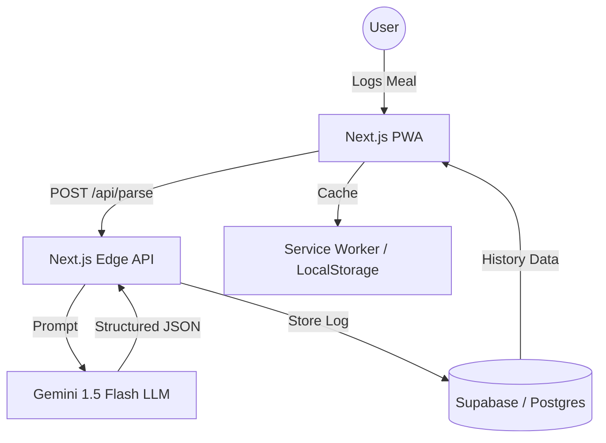
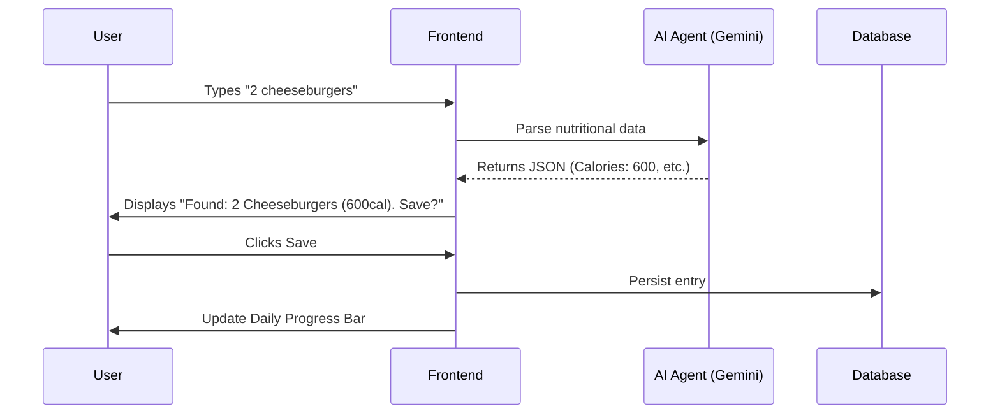

# GuiltFree
Log meals like a human, not a data entry clerk. GuiltFree uses AI to turn your '3 slices of pizza and a coke' into precise nutritional data. Total clarity, zero guilt.

# GuiltFree

Log meals like a human, not a data entry clerk. GuiltFree uses AI to turn your '3 slices of pizza and a coke' into precise nutritional data. Total clarity, zero guilt.

## 🚀 Vision
Most calorie trackers feel like a second job. GuiltFree eliminates the friction of searching through databases and weighing food by using LLMs to infer nutritional value from natural language cues.

## 🛠 Features (Detailed)

### 1. Magic Input Bar
- **Natural Language Parsing**: Just type what you ate. AI handles the rest.
- **Ambiguity Handling**: If you say "Sandwich", the AI makes an educated guess based on common types or asks for clarification.
- **Batch Entry**: Input multiple items at once (e.g., "Breakfast was 2 eggs, toast, and coffee").

### 2. Smart Diary
- **Visual Log**: A clean, chronological timeline of your meals.
- **Nutritional Breakdown**: Real-time totals for Calories, Protein, Carbs, and Fats.
- **Historical Insights**: 180-day history with scrollable views and basic trend charts.

### 3. Personal Dashboard
- **Goal Tracking**: Set daily calorie and macronutrient targets.
- **Progress Visualization**: Progress bars that fill up as you log.
- **Quick Actions**: "Re-log" frequent meals with one tap.

### 4. PWA Experience
- **Offline Mode**: View history even without a connection.
- **Native Feel**: Install as an app on iOS/Android for instant access.

## 📐 Architecture & Flow

### System Architecture

### User Flow

## 🏗 Tech Stack
- **Frontend**: Next.js 15 (App Router), Tailwind CSS, Lucide Icons.
- **AI**: Gemini 1.5 Flash (via Google AI SDK).
- **Backend / DB**: Supabase (Auth, Postgres).
- **Deployment**: Vercel.
